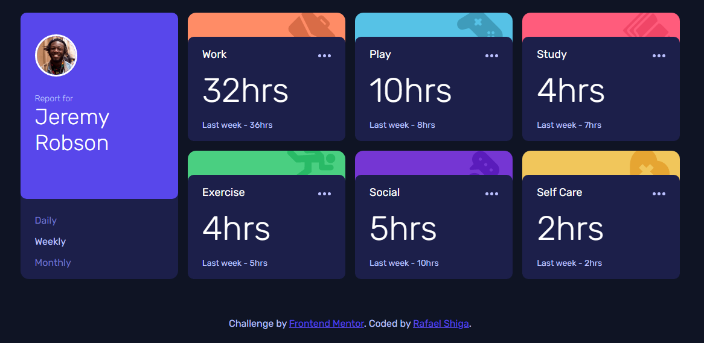

<h1 align="center">
  Time tracking dashboard
</h1>

<h3 align="center">
<strong>Project based on <a href="https://www.frontendmentor.io/challenges" target="_blank">Frontend Mentor Challenge </a></strong>
</h3>

  
  
  
  
   
   
  <a href="#space_invader-technologies">Technologies</a>
   
   
  
   
  <a href="https://shiga-time-tracking.netlify.app/" target="_blank">
    <h3 align="center"><b>VISIT</b></h3>
  </a>
   

## :space_invader: Technologies

- HTML
- SASS
